# RealEstateManager
Android application for real estate companies to manage their listings and for users to view and sell properties

 
 
 

Main Screen            |  App drawer functionalities
:-------------------------:|:-------------------------:
 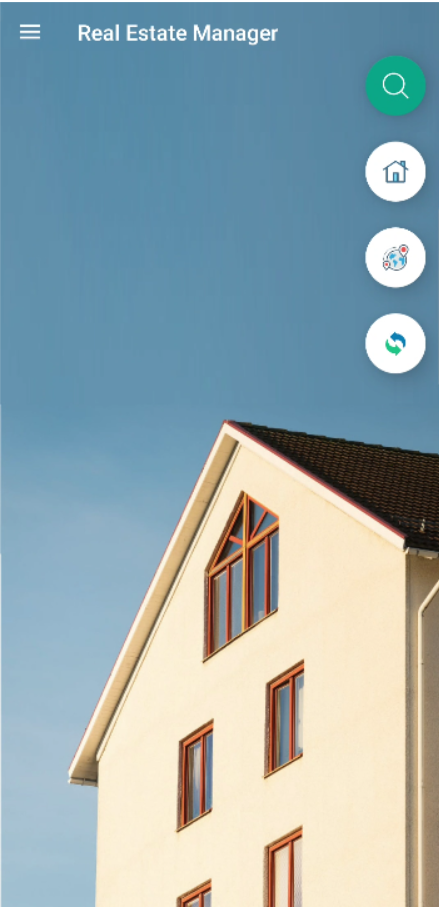 | 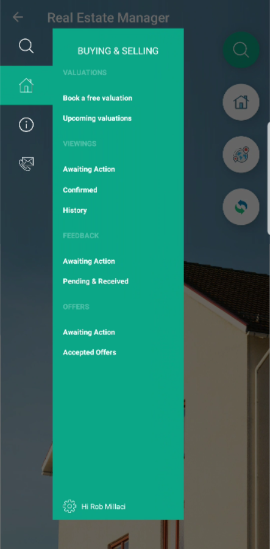

Book property valuations           |  View local properties on a map
:-------------------------:|:-------------------------:
 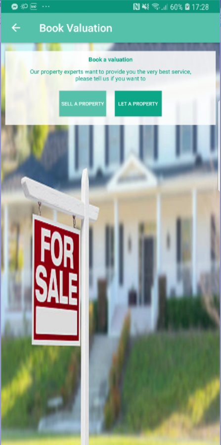 | 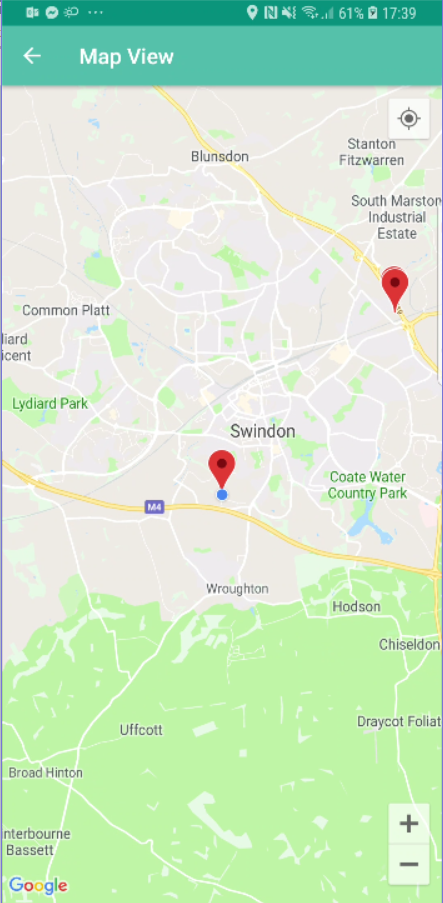
 
 
Search for properties using a range of search criteria          |  View details of each property
:-------------------------:|:-------------------------:
 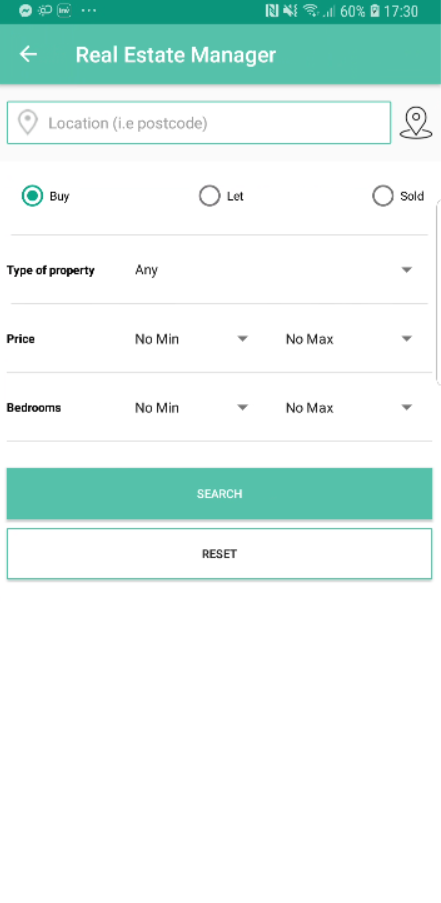 | 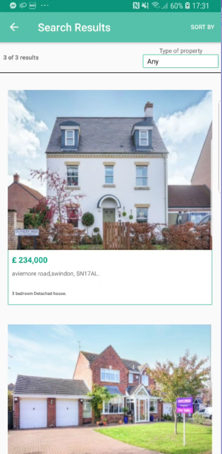
 
 Multiple filter and search criteria          |  Book viewings and make offers on properties
:-------------------------:|:-------------------------:
 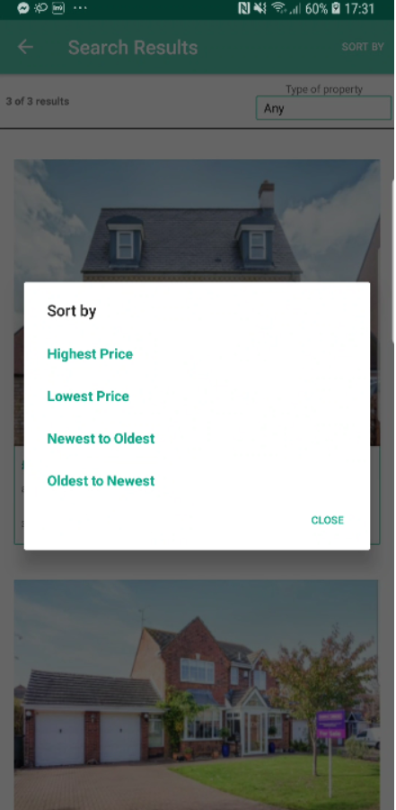 | 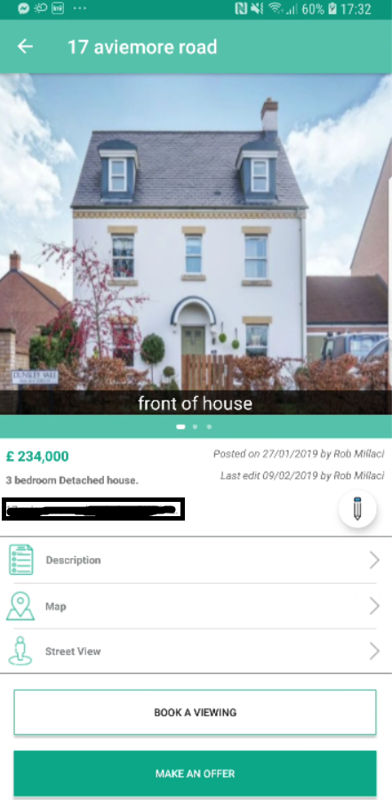
 
 View a properties street with google street view         | Administrators can upload new listings and edit existing ones
:-------------------------:|:-------------------------:
  | 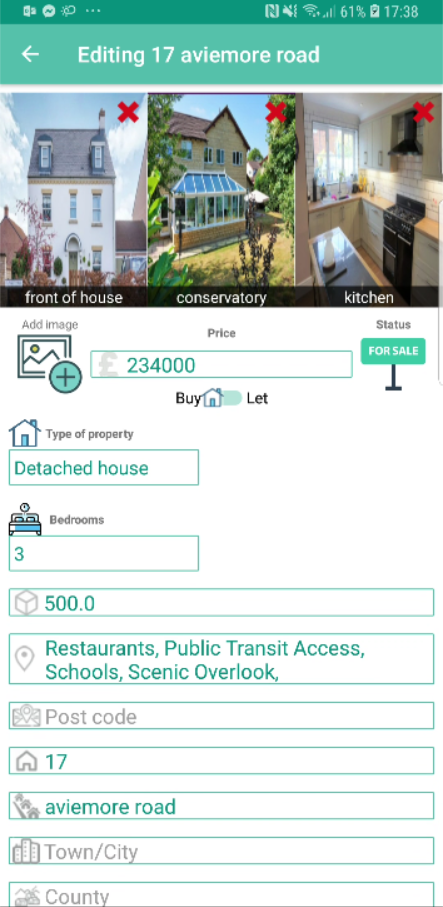
 
 Account details         | Notification controls
:-------------------------:|:-------------------------:
 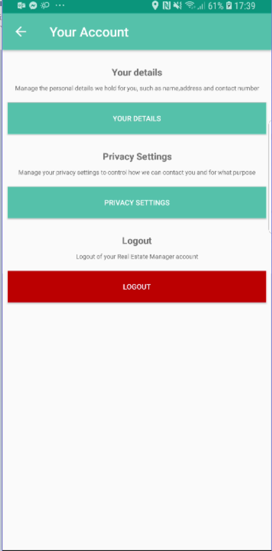 | 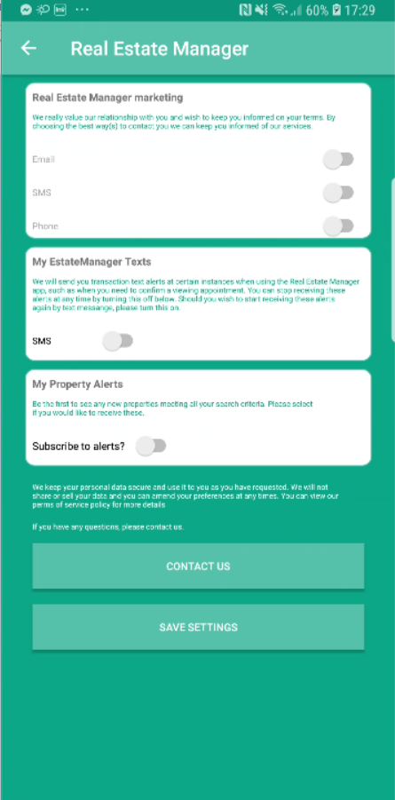

